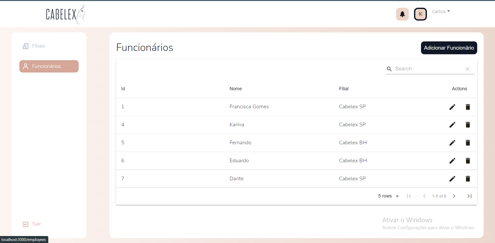

<h1 align="center">
    Cabelex
</h1>
<p align="center"💻Site para organizar as finanças, funcionários e filiais de uma loja de produtos de cabelo. </p>

<h1 align="center">
  
  
    
</h1>

### 🛠️ Features

- [x] Login.
- [x] Responsividade;
- [x] Cadastros/Edição/Exclusão de funcionários;
- [x] Cadastros/Edição/Exclusão de filiais;
- [x] Listagem e filtragem de funcionários;
- [x] Listagem e filtragem de funcionários;

 
 ### 🛠 Tecnologias

As seguintes ferramentas foram usadas na construção do projeto:

- [Figma] Acesso ao protótipo no link:(https://www.figma.com/file/FYqXI4iSidaSVSFBMMH9CA/Cabelex)
- [ReactJS](https://reactnative.dev/)
- [TypeScript](https://www.typescriptlang.org/)
- [NodeJS](https://nodejs.org/en/)
  
 ### 🛠 Como instalar no seu PC
 Front-End:
 
 * Abrir a pasta cabelex e seguir os seguintes passos:
 * Atráves do npm
  ```sh
  yarn
  ```
OU
* Atráves do yarn
  ```sh
  npm i
  ```

Assim criará a pasta node_modules. Em seguida basta digitar:

   ```sh
   yarn start
   ```
OU 

   ```sh
   npm start
   ```
 Back-End:
 
 * Abrir a pasta cabelex-api e seguir os seguintes passos:
 * Atráves do npm
  ```sh
  yarn
  ```
OU
* Atráves do yarn
  ```sh
  npm i
  ```

Assim criará a pasta node_modules. Em seguida basta digitar:

   ```sh
   yarn dev
   ```
OU 

   ```sh
   npm run dev
   ```
   
  Credenciais de login:
  
  USUÁRIO: carlos@outlook.com
  
  SENHA: 2897564A
 ---
 ### ✨Autor

[Karina Gomes](https://www.linkedin.com/in/karina-de-matos-gomes-a0a8121b2/)<br/>
Feito com ❤️ por Karina Gomes!

[](https://www.linkedin.com/in/karina-de-matos-gomes-a0a8121b2/) 
[](mailto:karinagomes70@gmail.com)
